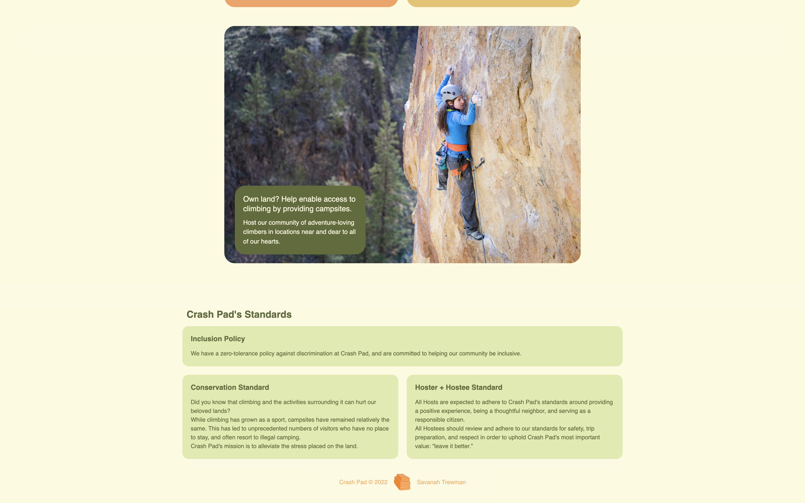
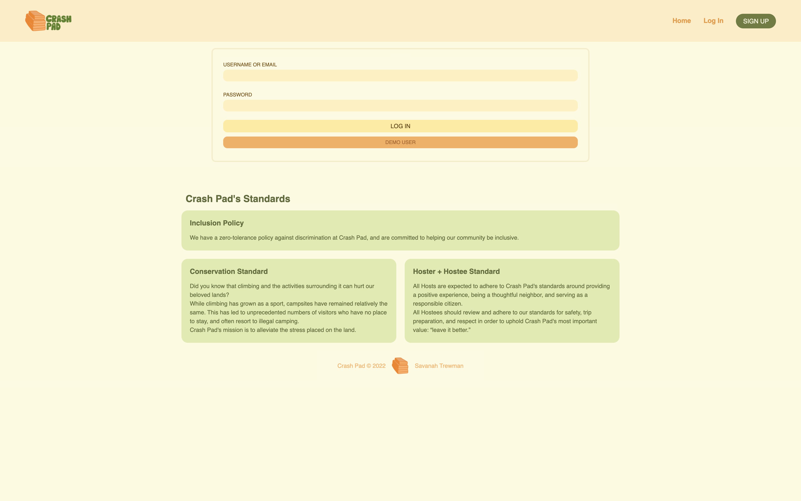
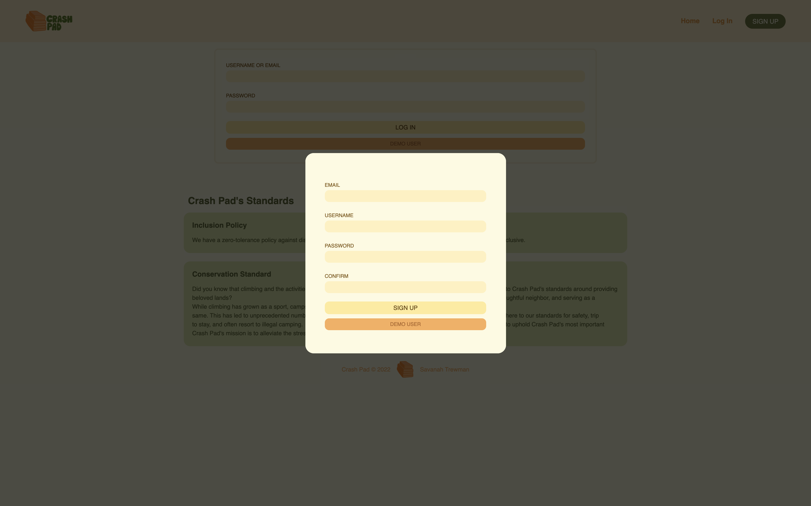
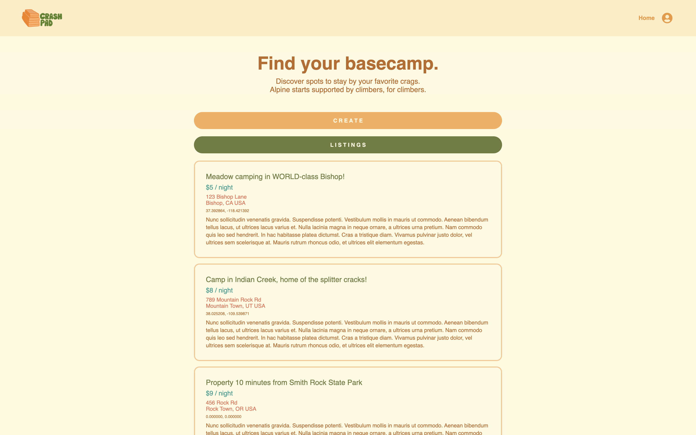
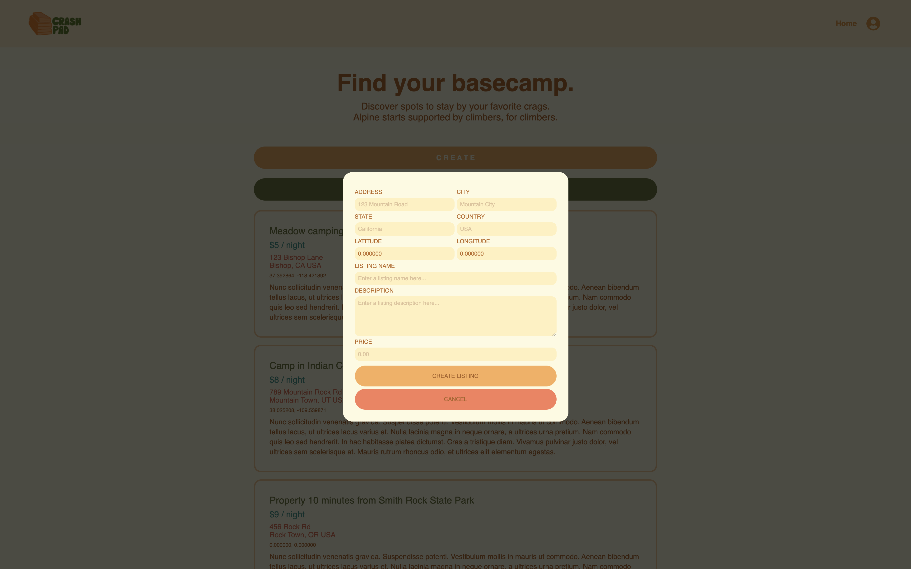
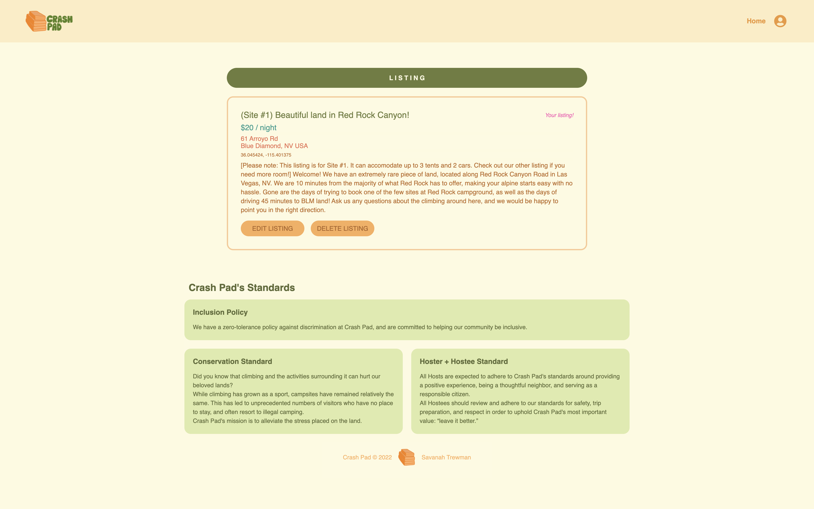
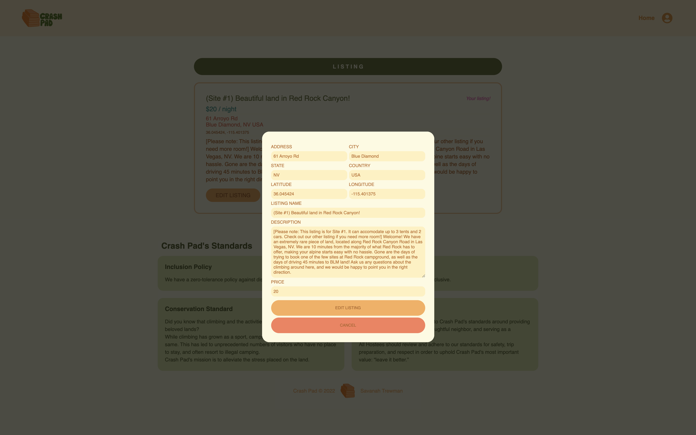

# Crash Pad

Crash Pad is an online marketplace for indoor and outdoor stays, targeted towards members of the outdoor climbing community. It is inspired by [Hipcamp](https://www.hipcamp.com/en-US).

Try listing or booking a campsite at my live site: [Crash Pad](https://crash-pad-stays.herokuapp.com/).

## Overview
Crash Pad is a site that allows logged-in users to find campsite listings in the vicinity of outdoor climbing locations. These campsite listings will be created by folks who are able to offer up a parcel of their land for fellow climbers and campers.

Crash Pad was created to help alleviate the stress placed on land surrounding major climbing crags. In recent years, the major growth of the climbing community (while amazing!) has resulted in major conservation issues. Campsite and hotel numbers have remained relatively stagnant in areas of outdoor recreation, and have been unable to support the large numbers of climbers flocking to popular crags. This has resulted in many resorting to illegal camping, often at the expense of the land. Crash Pad hopes to provide an alternative.

## Getting Started
To view and use this application, you can either navigate to the [live hosted site](https://crash-pad-stays.herokuapp.com/) and login as a new or demo user, or download the project locally:
1. Clone this repository ```git clone git@github.com:strewm/Crash-Pad.git```

2. Install dependencies ```npm install```

3.  Create a .env file based on the .env.example given

4.  Setup a PostgresSQL user + database in the backend folder
    ```javascript
    npx sequelize init
    psql -c "CREATE USER <username> PASSWORD '<password>' CREATEDB"
    npx dotenv sequelize db:create
    ```

5. Migrate and Seed models in the backend folder
    ```javascript
    npx dotenv sequelize db:migrate
    npx dotenv sequelize db:seed:all
    ```

6. Start the app by running ```npm start``` in both the frontend and backend folders

## Libraries Used


## Features
### Splash Page



### Login + Signup



### Home Page



### Individual Listings




## Future Features
- Additional listing information
    - Users will be able to view/upload images on listings
    - Users will be able to view/upload amenities on listings
- Contact
    - Users will be able to view/upload a listing owner's contact information
- Google maps API
    - Users will be able to view all listings on map
    - Users will be able to associate their listing to a User-placed location pin
- Search
    - Users will be able to search for listings by keyword
    - Users will be able to search for listings by suggested locations
